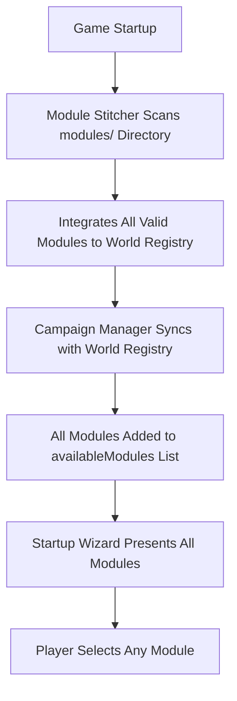

# Campaign Stitcher Analysis

## Executive Summary

The campaign stitcher system in this codebase is implemented through **three interconnected components** that manage module progression, availability, and transitions. However, the system **does not** gate module availability based on plot completion as initially thought. Instead, it focuses on **automatic module integration**, **geographic transitions**, and **conversation timeline management**.

## Key Finding: No Plot-Gated Module Progression

**Critical Discovery**: The campaign stitcher **does not implement module unlocking based on plot completion**. All modules in the `modules/` directory are automatically made available when detected by the module stitcher.

## Architecture Overview

### 1. Module Stitcher (`module_stitcher.py`)

**Primary Role**: Automatic module discovery and integration

**Key Responsibilities**:
- **Automatic Detection**: Scans `modules/` directory on startup for new modules
- **ID Conflict Resolution**: Automatically resolves area/location ID conflicts between modules
- **Safety Validation**: File security, AI content review, schema compliance
- **Travel Narration**: Generates AI-powered transition narration between modules
- **World Registry**: Maintains `modules/world_registry.json` with all integrated modules

**Important**: This component makes **ALL detected modules immediately available** - there is no gating mechanism based on plot completion.

### 2. Campaign Manager (`campaign_manager.py`)

**Primary Role**: Campaign state and inter-module continuity

**Key Responsibilities**:
- **Module Transition Detection**: Identifies when players move between modules
- **Automatic Summarization**: Generates AI summaries when leaving modules
- **Hub-and-Spoke Model**: Supports returning to previously visited modules
- **State Persistence**: Tracks completed modules, relationships, artifacts
- **Context Management**: Provides accumulated summaries for AI context

**Module Availability Logic**:
```python
def can_start_module(self, module_name: str) -> bool:
    """Check if a module can be started"""
    # Simple check - is it in available modules?
    return module_name in self.campaign_data.get('availableModules', [])
```

The `availableModules` list is populated by **module stitcher discovery**, not plot completion.

### 3. Startup Wizard (`startup_wizard.py`)

**Primary Role**: Initial module selection and character creation

**Key Responsibilities**:
- **Module Discovery**: Uses module stitcher to find available modules
- **Player Choice**: Presents all discovered modules to player
- **Character Creation**: AI-powered character generation
- **Initial Setup**: Updates party tracker with selected module

**No Progression Gates**: All detected modules are presented as options regardless of any progression state.

## Module Availability Flow



## Transition System

### Module Transition Detection
- **Location-Based**: Detects transitions via location ID changes
- **Geographic Boundaries**: Uses `ModulePathManager` to determine module ownership
- **Automatic Processing**: Inserts transition markers in conversation

### Conversation Timeline Management
- **Marker Insertion**: "Module transition: [from] to [to]" markers
- **AI Summarization**: Full adventure summaries generated from conversations
- **Sequential Archiving**: `modules/campaign_archives/` and `modules/campaign_summaries/`
- **Chronological Preservation**: Maintains adventure sequence across modules

## Integration Points

### With Main Game System
1. **Startup Integration**: `main.py` checks `startup_required()` and runs startup wizard
2. **Action Handler**: Detects module transitions during location changes
3. **Party Tracker**: Module field determines current active module
4. **AI Context**: Campaign manager injects accumulated summaries

### File Structure
```
modules/
├── [Module_Name]/               # Individual modules
├── world_registry.json          # Module stitcher registry
├── campaign.json               # Campaign manager state
├── campaign_archives/          # Conversation archives
└── campaign_summaries/         # AI-generated summaries
```

## Plot Completion System

### Current Plot Tracking
- **Module Plot Files**: `module_plot.json` tracks plot point completion
- **Party Tracker Sync**: Quest statuses synchronized between files
- **No Module Gating**: Plot completion does not affect module availability

### Plot Completion Logic
```python
def check_module_completion(self, module_name: str) -> bool:
    """Check if module is complete based on module_plot.json"""
    # Checks if final plot point has status == 'completed'
    # BUT this does not gate new module availability
```

## Missing Components for Plot-Gated Progression

To implement automatic module sequencing based on plot completion, the system would need:

### 1. Plot Completion Triggers
```python
# Missing: Module unlocking logic
def check_and_unlock_next_modules(completed_module):
    """Unlock subsequent modules based on completion"""
    # This functionality does not exist
```

### 2. Module Dependency System
```python
# Missing: Module prerequisites
{
    "moduleName": "Advanced_Module",
    "prerequisites": ["Starter_Module", "Intermediate_Module"],
    "unlockCondition": "all_plots_completed"
}
```

### 3. Automatic Progression Detection
```python
# Missing: Plot completion monitoring
def monitor_plot_completion_for_unlocks():
    """Monitor for module completion and unlock next modules"""
    # This is not implemented
```

## Recommendations for Automatic Module Sequencing

### 1. Extend Module Metadata
Add dependency information to module files:
```json
{
    "dependencies": {
        "requiredModules": ["Module_A", "Module_B"],
        "unlockCondition": "all_plots_completed",
        "automaticTransition": true
    }
}
```

### 2. Enhanced Campaign Manager
Implement progression logic:
```python
def check_for_module_unlocks(self, completed_module):
    """Check if completing a module unlocks others"""
    
def get_next_available_modules(self):
    """Get modules that can be unlocked based on current progress"""
```

### 3. Plot Completion Integration
Link plot completion to module progression:
```python
def handle_plot_completion(self, module_name, plot_data):
    """Handle module completion and automatic unlocking"""
```

## Compatibility Requirements

Any automatic module sequencing system must maintain compatibility with:

1. **Isolated Module Architecture**: Each module remains self-contained
2. **AI Travel Narration**: Seamless transitions between modules
3. **Conversation Timeline**: Chronological adventure preservation
4. **Hub-and-Spoke Model**: Ability to revisit completed modules
5. **World Registry**: Module stitcher integration
6. **Safety Validation**: Content and security checks

## Conclusion

The current campaign stitcher system provides excellent infrastructure for module management and transitions but **does not implement plot-gated module progression**. All modules are made available immediately upon detection. To add automatic module sequencing, new logic would need to be implemented that works within the existing architecture while preserving the system's core design principles of module isolation and seamless transitions.